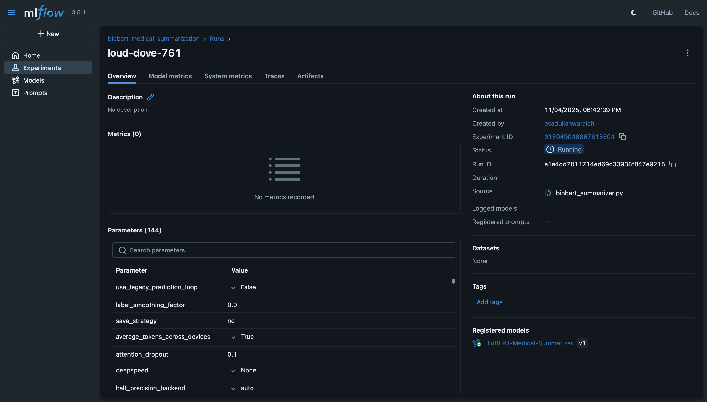

# DistilBERT Medical Text Summarization with MLflow

## Overview
This project uses DistilBERT to classify important sentences in MIMIC-III discharge summaries, with experiment tracking through MLflow. The model identifies which sentences are important based on medical features like urgency indicators and lab results.

## What This Code Does

1. **Loads medical data** from processed CSV files (47 engineered features + cleaned text)
2. **Creates importance labels** based on urgency, abnormal labs, and complexity scores
3. **Trains DistilBERT** to classify sentences as important/not important
4. **Tracks experiments** with MLflow
5. **Saves the model** for future use

## MLflow Features Actually Implemented

### Experiment Tracking
The code tracks these items in MLflow:
```python
# Parameters logged
- model_name: "distilbert-base-uncased"
- batch_size: 8
- max_length: 512
- train_size: number of training samples

# Metrics logged
- eval_loss: evaluation loss from trainer
- eval_runtime: time taken for evaluation
- eval_samples_per_second: evaluation speed
```

### Model Registry
```python
# Model saved to MLflow
mlflow.pytorch.log_model(
    pytorch_model=model,
    artifact_path="biobert_model",
    registered_model_name="BioBERT-Medical-Summarizer"
)
```

## Project Structure

```
Lab1/
├── biobert_summarizer.py     # Main training script
├── requirements.txt          # Python dependencies
├── data/
│   ├── mimic_features_advanced.csv      # 47 engineered features
│   └── processed_discharge_summaries.csv # Cleaned medical text
└── results/
    └── mlFlow_DistilBERT.png  # MLflow UI screenshot
```

## How to Run

### Prerequisites
```bash
# Create virtual environment
python3 -m venv venv
source venv/bin/activate  # On Mac/Linux
# or
venv\Scripts\activate  # On Windows

# Install dependencies
pip install transformers torch pandas scikit-learn mlflow numpy
```

### Start MLflow UI
```bash
# In one terminal, start MLflow tracking server
mlflow ui

# This runs on http://localhost:5000
```

### Run Training
```bash
# In another terminal, run the training script
python biobert_summarizer.py
```

### Expected Output
```
Starting Model training script...
Loading data from pipeline...
Loading features from: /path/to/mimic_features_advanced.csv
Loading text from: /path/to/processed_discharge_summaries.csv
Merged data: 5100 rows, 48 columns
Training samples: 100, Test samples: 50
Loading Model...
Starting training...
Evaluation results: {'eval_loss': 0.656, 'eval_runtime': 2.5, ...}
Model saved to ../models/biobert_summarizer

=== Testing Model ===
Sample text (first 200 chars): patient admitted with chest pain...
Predicted importance: Important
Confidence: 78.45%
```

## View Results in MLflow

1. Open browser to `http://localhost:5000`
2. Click on **Experiments** → `biobert-medical-summarization`
3. Click on the latest run to see:
   - Parameters (model settings)
   - Metrics (loss values)
   - Artifacts (saved model files)



## How the Model Works

### Data Processing
```python
# Create importance score from medical features
importance_score = (
    urgency_indicator * 0.4 +     # 40% weight for urgency
    abnormal_lab_ratio * 0.3 +    # 30% weight for abnormal labs
    complexity_score * 0.3         # 30% weight for complexity
)

# Convert to binary labels
is_important = (importance_score > median_score)
```

### Training Process
- Uses 100 training samples (for quick testing)
- Runs for 1 epoch
- Batch size of 16
- Maximum text length of 512 tokens

## Key Files Explained

### biobert_summarizer.py
Main script that:
1. Loads data from CSV files
2. Prepares text and labels
3. Initializes DistilBERT model
4. Trains with Hugging Face Trainer
5. Logs results to MLflow
6. Saves model locally and to MLflow

### Data Requirements
The script expects these files in `data-pipeline/data/processed/`:
- `mimic_features_advanced.csv`: Contains columns like:
  - `hadm_id`: Hospital admission ID
  - `urgency_indicator`: Binary urgency flag
  - `abnormal_lab_ratio`: Ratio of abnormal lab results
  - `complexity_score`: Medical complexity measure
  
- `processed_discharge_summaries.csv`: Contains:
  - `hadm_id`: Hospital admission ID
  - `cleaned_text`: Preprocessed medical text

## Simple MLflow Commands

### View all experiments
```python
import mlflow
experiments = mlflow.search_experiments()
for exp in experiments:
    print(f"{exp.name}: {exp.experiment_id}")
```

### Load a saved model
```python
import mlflow.pytorch

# Load by run ID (check MLflow UI for run ID)
model = mlflow.pytorch.load_model("runs:/YOUR_RUN_ID/biobert_model")
```

### Compare runs
In MLflow UI:
1. Select multiple runs using checkboxes
2. Click "Compare" button
3. View side-by-side metrics and parameters

## Troubleshooting

### Issue: "Cannot find data files"
- Make sure the CSV files are in the correct path
- Update `BASE_DIR` in the script to match your directory structure

### Issue: "Out of memory"
- Reduce batch size in TrainingArguments
- Reduce number of training samples
- Use smaller max_length (e.g., 256 instead of 512)

### Issue: "MLflow UI not showing runs"
- Make sure MLflow UI is running (`mlflow ui`)
- Check that the script completed without errors
- Refresh the browser page

## What's Next?

After running this basic version, you can:
1. **Increase training data** - Use more than 100 samples
2. **Add more epochs** - Train for 3-5 epochs
3. **Calculate more metrics** - Add accuracy, F1 score
4. **Experiment with hyperparameters** - Try different batch sizes, learning rates
5. **Compare models** - Try BioBERT vs DistilBERT

## Minimal Working Example

```python
# Quick test to verify setup
import mlflow
import torch
from transformers import AutoTokenizer, AutoModelForSequenceClassification

# Start MLflow
mlflow.set_experiment("test-experiment")

with mlflow.start_run():
    # Log a parameter
    mlflow.log_param("test_param", "hello")
    
    # Log a metric
    mlflow.log_metric("test_metric", 0.95)
    
    print("Check MLflow UI at http://localhost:5000")
```

## Summary

This implementation demonstrates:
-  MLflow experiment tracking
- Training a DistilBERT model on medical text
- Logging parameters and metrics
- Saving models to MLflow
